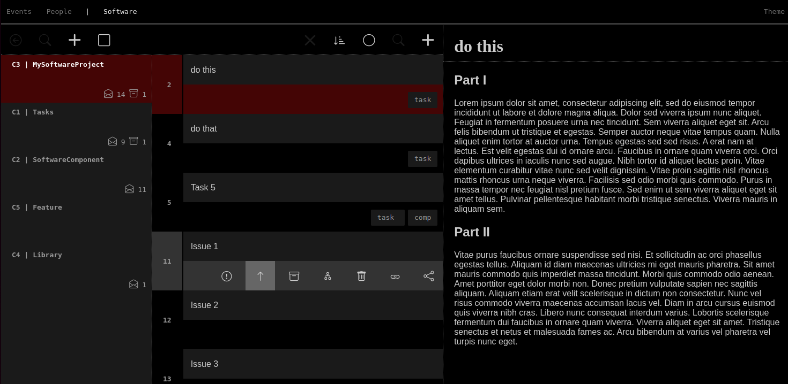

# Cometoid
      
An issue management system, written in **Elixir**, based on a very simple data model which makes it very versatile. 
It comes with a text editor written in **ClojureScript** which was aimed at giving me some of the keyboard shortcuts
(wordwise navigation and such things) I have in VSCode.

Another issue tracker, Dan, really? Yes, I think it's sufficiently different. Here's [why](./rationale.md)

In its current state, Cometoid is designed to run in a desktop environment, supporting a single user.



## Getting started

### Prerequisites

- Elixir
- A running postgres database

### Preparations

    $ cp config/dev.secret.template.exs config/dev.secret.exs
    $ vim config/dev.secret.exs # Edit settings
    $ ./init.sh
    $ mix ecto.setup

### Start

    $ mix phx.server
    Visit http://localhost:4000

Also provides the hot-code-reload for the editor which is written in ClojureScript. In the js console, a message `shadow-cljs: #x ready!` shows that the websocket connection for shadow-cljs has been established.

For a repl into the running editor environment, run 

    2$ cd assets
    2$ npx shadow-cljs cljs-repl app
    cljs.user=> (js/alert "Hi")
    nil

An alert should pop up in the browser. Here as well, new code is compiled and available immediately. Just call your function of choice again after hitting `save`.

### Tests

Phoenix App Tests

    $ mix test

Clojure Editor tests

    $ cd assets
    $ clj -Xtest :dirs '["test/cljc"]'

To develop tests, use

    1$ npx shadow-cljs server    # shows nrepl port
    2$ npx shadow-cljs watch app

Then jack-in. With VSCode, use

- REPL
    - Connect to a running REPL in your project
        - .../cometoid/assets
            - ClojureScript nREPL Server
                - localhost:\<port\>

```clojure
(require '[editor.lowlevel-test :as llt])
(llt/caret-left-base-case)
```

## Deployment for Production

    $ cp config/dev.secret.template.exs config/dev.secret.exs
    $ cp config/prod.secret.template.exs config/prod.secret.exs
    $ vim config/prod.secret.exs # Edit settings
    $ ./init.sh
    $ cd assets
    $ npx shadow-cljs release app
    $ cd ..
    $ mix assets.deploy
    $ export SECRET_KEY_BASE=SOMESECRETKEYBASE
    $ MIX_ENV=prod mix ecto.setup # or ecto.migrate
    $ MIX_ENV=prod mix phx.server
    Visit http://localhost:4001

## Usage

See [usage](./usage.md)
